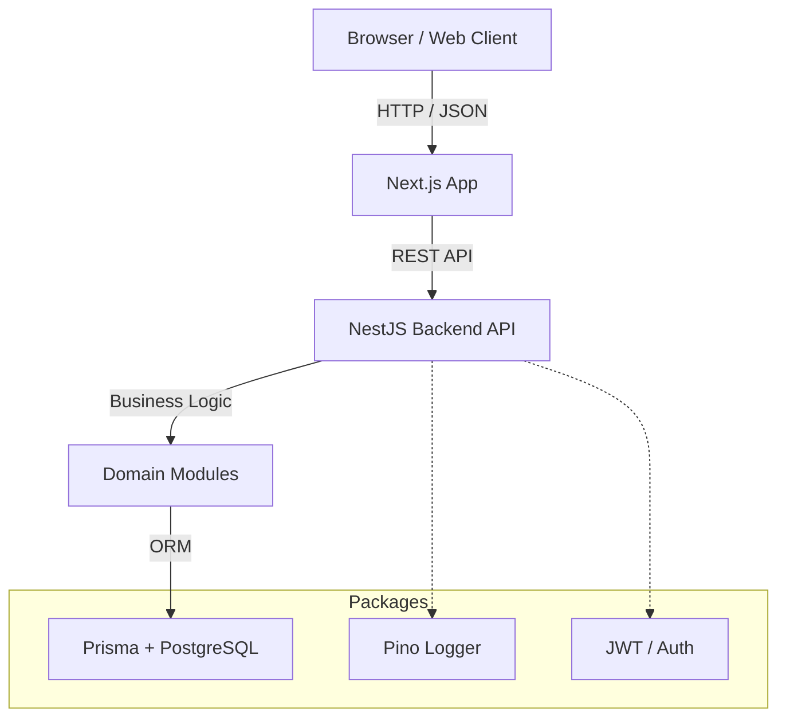

# Architecture

Commerce OS is built upon a modern, modular, and scalable technology stack based on the **Document + Ledger** pattern.

## High-Level Architecture

## 1. Monorepo (Turborepo + PNPM Workspaces)
The project is split into applications (`apps/`) and shared packages (`packages/`).
- `apps/api`: NestJS backend.
- `apps/web`: Next.js frontend (TBD).
- `packages/*`: Shared utilities, types, database schema.

## 2. Domain-Driven Module Structure
Instead of grouping by file types (e.g., all controllers in one folder), we group by **Domain**.
- `apps/api/src/modules/inventory`
- `apps/api/src/modules/products`
- `apps/api/src/modules/orders`

Each module acts as an independent vertical slice containing its own Controller, Service, and DTOs.

## 3. Feature Flags (TBD)
To support multi-tenancy and incremental rollouts, Commerce OS will use Feature Flags to toggle functionality per Organization or Store (e.g., "Enable TikTok Shop Sync" or "Enable Advanced Routing").

## 4. Event Bus
Commerce OS will standardize on internal events to trigger side-effects asynchronously.
Example standard events:
- `product.created`
- `inventory.adjusted`
- `order.completed`

*(See ADR for decision details on event architecture).*